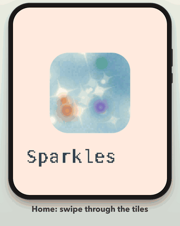

# Waveshare AI

[](docs/media/waveshare-ai-demo.mp4)

Waveshare AI is a compact companion for the **Waveshare ESP32-S3-Touch-AMOLED-1.8 V2**.
The ESP-IDF device core provides Home, Settings, Wi-Fi, themes, battery and power controls;
optional shared plugins add connected tiles.

The linked MP4 and GIF are a clearly labeled scripted host render produced by the actual firmware
UI, decoder and interaction paths. They use fictional session, conversation, sensor, network and
account data. They are not camera footage or evidence of physical-device smoothness.

## Requirements

- Waveshare ESP32-S3-Touch-AMOLED-1.8 **V2** and a USB-C data cable
- macOS or Linux, Git, a C compiler and Python 3.11+
- ESP-IDF **6.0.2** and its Python environment
  ([Espressif setup](https://docs.espressif.com/projects/esp-idf/en/v6.0/esp32s3/get-started/))

V1 is untested and ESP32-C6 is unsupported. USB is used for flashing/debugging; normal operation
uses 2.4 GHz Wi-Fi and battery power.

## Install the device

```sh
git clone https://github.com/gabrielAHN/waveshare-ai.git
cd waveshare-ai
cp .env.example .env
chmod 600 .env
# Edit the private .env, then build without touching USB.
NO_FLASH=1 ./dev.sh
tools/flash.sh
```

`dev.sh` runs the host suite and builds the named device firmware. Set `IDF_PATH` if ESP-IDF is
not at `../esp-idf-6.0.2`. `tools/flash.sh` flashes the build and provisions the private Wi-Fi
values from `.env`; it does not compile them into firmware.

For download mode, Wi-Fi/hotspot setup, provider build combinations, power and touch controls,
read the [device installation guide](devices/waveshare-esp32-s3-touch-amoled-1-8-v2/README.md).

## Install a plugin

Plugins are compile-time selections, not hot-loaded modules. Their host services use the shared
Python bridge and certificate-pinned board enrollment.

| Provider | Device tiles | Complete installation |
|---|---|---|
| [Hermes](plugins/hermes/README.md) | Sparkles activity and Ask through each profile's stock Gadget SDK | [Hermes install, authorization and verification](plugins/hermes/README.md#install) |
| [Home Assistant](plugins/home_assistant/README.md) | Sensor air quality, temperature, humidity and pressure | [Standalone HA install, authorization and verification](plugins/home_assistant/README.md#install) |
| [Device core](devices/waveshare-esp32-s3-touch-amoled-1-8-v2/README.md) | Home, Settings, themes, battery and power | Build with `PROVIDERS=none` |

When both providers resolve to the same OIDC public client and endpoint paths, the board shows one
phone QR/account. Hermes and Home Assistant still enforce separate group policies. Service tokens
remain on their server-side adapters and are never copied to the board.

## Repository

- [`devices/waveshare-esp32-s3-touch-amoled-1-8-v2/`](devices/waveshare-esp32-s3-touch-amoled-1-8-v2/) — supported device and firmware
- [`plugins/`](plugins/) — shared optional providers
- [`bridge/`](bridge/) — Python host service, enrollment and provider adapters
- [`tools/`](tools/) and [`tests/`](tests/) — root build, flash, render and offline verification entry points
- [Architecture](docs/ARCHITECTURE.md), [security](docs/SECURITY.md) and [bridge reference](bridge/README.md)

```sh
tests/run_host_tests.sh
(cd bridge && PYTHONPATH="$PWD" python -m unittest discover -s tests -t .)
python3 tools/check_links.py
```

## License

MIT ([LICENSE](LICENSE)); bundled components retain their licenses.
[Material Symbols attribution](docs/MATERIAL-SYMBOLS.md).
