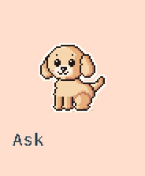
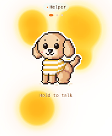
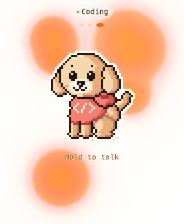
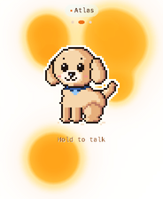

# Bot art

The Ask page shows one character for every bot: **Kotaro**, a pixel-art toy poodle. He is the same dog
for every bot, and only his clothes change. The Home screen's Ask tile shows him without clothes. On
each bot's Ask page he wears that bot's outfit, and when you swipe to another bot he changes into its
outfit.

Kotaro is the **reference art**. Use him as he is, dress him for your own bots, or draw your own
character in his place.

| Home Ask tile | helper | coding | any other bot |
|---|---|---|---|
|  |  |  |  |

Host renders from the firmware, not photos (`tools/render_docs_previews.sh`).

## How it is drawn

`plugins/hermes/firmware/bot_art.h` draws everything in code; there are no bitmaps and no photos.

1. **Shapes.** Each frame paints ellipses and rectangles into a 45 × 48 cell sprite grid. Every cell
   stores a colour slot and a *part* (tail, torso, shirt, hind leg, hood, ears, legs, head). Later parts
   are in front of earlier ones. The top 4 rows are headroom, so ears, a bounce, the thought cloud or a
   heart are never cut off at the grid edge. His body has three key poses (sitting, the play bow and
   lying down); poses in between mix them.
2. **Band shading.** Light comes from the upper left. On each row a part's right end is rose and the
   cells before it are tan. Its lower right edge is shaded and its upper left edge is highlighted.
   Cloth gets the same treatment in cloth colours, and where cloth meets his fur its edge is the dark
   hem trim.
3. **Decals.** The face (muzzle, eyes with a glint, brows, nose, mouth, cheeks) and the outfit
   prints are painted on top.
4. **Outline and rim.** A 1-cell black outline goes round every part and between overlapping parts,
   except where a leg grows out of the body or the shirt sits on it. A white sticker rim goes round
   the outside.
5. **Blit.** The grid is scaled up by whole screen pixels per cell: 4 on the Ask page and the Home
   tile, 2 in the chat row. Cells stay crisp. A jump moves the whole sprite in screen pixels (eased);
   his ground shadow stays on the ground and shrinks. When he turns round, two turn frames squash the
   sprite to 3/4 and 1/2 width before it shows mirrored, so he never flips instantly.

**Clothes** are worn like a dog shirt. The tee, striped tee and hoodie wrap his chest and shoulders,
his back to just before the tail, and down over his belly, with a hem that curves along his body. His
front legs come out of the shirt (it overlaps their tops), stripes run round him, and the cloth is
darker on his back edge and underside. Prints stay on his chest. The hood lies on the back of his
neck, and the collar is a band that follows his neck. No cloth ever lands on his head, ears, eyes,
tail, hind leg or paws, in any pose. The Home Ask tile's Kotaro wears nothing.

**Moods** follow the Ask page:

| Mood | What he does |
|------|--------------|
| idle | breathes, blinks, sways his tail (a wag burst now and then), glances round, flicks an ear; idle routines (below) |
| listening | sits up, ears perk up, mouth opens with the voice level, a glow round his head |
| working | rocks under a thought cloud whose dots fill in, ears take turns, a paw taps |
| done | celebrates (crouch, jump with a spin in the air, sparkles), then the happy wag, then calm idle |
| error | sad: droopy ears, sad brows, a tear, tail down |
| stopped / stopping | sleepy |
| disabled | asleep, in greys |
| loading | dozes in colour: eyes shut, a slow nod, Zz (Ask page and the Home Ask tile) |

**Idle routines.** Between quiet stretches of breathing and blinking, he plays one routine every 6 to
12 seconds: a stretch (a play bow), a yawn, a scratch behind his ear with a hind leg, sniffing the
ground and turning round to sniff the other way, or chasing his tail (two spins). The order is a
shuffle from a PRNG seeded by the clock: every routine comes once per round, never twice in a row.
Routines only play while he is idle (or a while after a reply), never while you touch the page, never
while he listens, thinks or works, and a routine always plays to its end.

**Nap.** After 2 minutes on the Ask page with no touch and no activity, he lies down with his head on
his paws, closes his eyes, breathes slowly and lets Zz drift up. Any touch on the page, or any
activity (a command, a reply, a bot swipe), wakes him with a stretch. Coming back to the page, he is
awake.

**Reactions.** A quick tap on him: his ears perk, he bounces and a heart pops up. Pressing to talk:
while the press arms (0.4 s) he sits up, tilts his head towards you and perks his ears; then the
listening animation starts. Releasing (the command is sent): a nod.

**Motion rules.** Everything runs on real elapsed time (`helper_tick` in `helper_ui.h` keeps his
clocks; `bot_animate` in `bot_art.h` turns them into a pose). A mood switch eases from the source mood's
pose into the new one over 0.3 s. Whole-body jumps move in screen pixels; his parts move by whole
cells, so the pixel art stays on its grid. His breathing only runs while nothing else moves him, so it
never meets another move. Between two 20 fps frames his body moves at most one cell, with no
one-frame pops (`tests/host/kotaro_motion_test.c`).

The dog is also the hold-to-talk control. Every pixel stays inside the bot's touch box
(`helper_bot_box` in `helper_ui.h`; taller in the big layout so a jump has room), and
`tests/host/bot_graphic_test.c` and `tests/host/kotaro_outfit_test.c` check that.

## Dress a bot

A bot's id is its Hermes profile name, as listed in `bridge.json` `providers.hermes.bots`. The art picks
the outfit row with that id. The repo ships three outfits: `helper` (a striped t-shirt), `coding` (a
coral hoodie with `</>`), and a blue collar that any other id wears. A fourth, unclothed row is the
Home tile's.

Your own bots' outfits stay **out of the repo**:

1. Copy `plugins/hermes/firmware/bot_outfits_local.example.h` to `plugins/hermes/firmware/bot_outfits_local.h`. The copy is
   git-ignored.
2. Write one row per bot into its `BOT_OUTFITS_LOCAL` macro.
3. Rebuild.

`bot_art.h` includes that file when it exists and appends its rows after the built-in ones. A
public build without the file still works: those bots wear the collar. Public demo and motion-preview
builds define `BOT_NO_LOCAL_OUTFITS` so private outfits cannot enter their output.

```c
/* plugins/hermes/firmware/bot_outfits_local.h */
static const char *const bot_print_star[3] = {".#.", "###", ".#."};
#define BOT_OUTFITS_LOCAL                                                                         \
  /* research: a green t-shirt with a white star */                                            \
  {"research", BOT_WEAR_TEE, false, {{80, 170, 110}, {56, 140, 86}, {36, 104, 64}, {250, 250, 240}}, \
   {{17, 26, BOT_INK_LIGHT, 3, bot_print_star}}},
```

To ship an outfit for everyone, add the row to `bot_outfits` in `bot_art.h` instead. Put it after the
four fixed rows, because their positions are the `BOT_LOOK_*` names.

Each row has these fields:

| Field | Meaning |
|-------|---------|
| `id` | the bot id (Hermes profile name) |
| `wear` | `BOT_WEAR_TEE`, `BOT_WEAR_STRIPED_TEE` (stripes in `light`), `BOT_WEAR_HOODIE` (adds a hood on the back of his neck), `BOT_WEAR_COLLAR`, or `BOT_WEAR_NONE` |
| `dot_deep` | colour the thought-cloud dots with `emblem` instead of `body` (for pale cloth) |
| `pal` | four RGB colours: `body` (main cloth), `deep` (its shade), `emblem` (hem, trims, dark prints) and `light` (stripes, light prints) |
| `print` | up to two chest prints, each `{x, y, ink, rows, bits}` |

The chest prints are tiny bitmaps: `'#'` is a cell and `'.'` is empty. They sit at grid cell (x, y)
and are inked in `light` (`BOT_INK_LIGHT`) or `emblem` (`BOT_INK_EMBLEM`). The chest is roughly
x 10–27, y 21–33. Prints only land on the shirt (or, for a collar tag, his neck), so they never spill
onto his fur, and they move with his chest when he bends.

Garments are worn round his body (see **Clothes** above): a shirt covers his chest, back and belly,
the hem curves from just before the tail down to his belly, and his rump and hind leg stay fur.

## Preview without the board

```sh
tools/bot_preview.sh            # -> build/bot-preview/ (the folder is recreated)
```

The script needs only a C compiler; ImageMagick is optional and turns the output into PNG sheets:

- `sheet.png`: one row per look, one column per mood;
- `mirrored.png` and `compact.png`: the same, facing the other way and at the chat-row size;
- `animations.png`: a 10-frame strip of every animation (stretch, yawn, scratch, sniff, chase,
  celebrate, nap, wake, tap, lean-in, nod) in the striped tee and in the hoodie;
- `zoom/<animation>.png`: each strip at 3×, nearest-neighbour, for a close look.

It also writes each look's Ask page (`page-look*.png`) and the Home Ask tile (`home-ask-tile.png`).
Then run the art tests:

```sh
bash tests/run_host_tests.sh bot_graphic_test kotaro_outfit_test kotaro_motion_test home_art_center_test material_home_test
```

The tests check the following:

- the drawing stays inside the touch box and fills most of it, in every mood, animation frame and mood
  blend, mirrored, big and compact; no part of him reaches the sprite grid's edge, where it would be
  cut off; the boxes clear the chat, status row, page dots and rounded panel safe area;
- shirts cover at least 60 % of his body and of his back, the hem is curved, the legs come out of the
  shirt, stripes run round him, the back edge is shaded, prints stay on the chest; the hood is on the
  back of his neck and the collar on his neck; no cloth on his head, ears, tail, hind leg or paws;
- the routines, the nap, the celebration, the tap, the lean-in and the nod happen when they should
  (through the real touch path) and never when they should not; his motion is smooth;
- every outfit differs visibly from the others;
- the plain look has no cloth colours;
- disabled is grey;
- the Home tile is centred and stays inside its icon box.

## Draw your own character

You can replace Kotaro with your own character in `bot_art_draw()`. Keep the moods, the parts and
the passes described above, and change only the shapes. These guidelines help:

- **Order.** Draw parts back to front. For example, his far ear is drawn before the head and his
  hind leg before the front legs.
- **Shapes.** Ellipses and rectangles in cell units are enough. An ellipse edge that exactly touches
  a cell centre makes a 1-cell nub, so nudge the radius by 0.1.
- **Clothes.** Put clothes on the parts they cover, so the outline and shading follow them.
- **Motion.** Keep moves continuous: give `bot_animate()` eased values, and let whole cells come only
  from rounding them at draw time.
- **Testing.** Keep `tests/host/bot_graphic_test.c`, `tests/host/kotaro_outfit_test.c` and
  `tests/host/kotaro_motion_test.c` passing. Change their thresholds only when your character is genuinely
  different, not to hide a regression.

## Rules

- Commit art you made or have the rights to. Never commit photos of real people or pets.
  Kotaro was drawn from scratch in code, after the reference style.
- Keep art bounded: use the fixed sprite grid, skip empty rows and measure frame time on the board.
  Host render timing does not establish the device's display rate.
