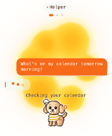
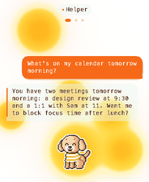

# Hermes plugin

Hermes adds **Sparkles** for open-session activity and **Ask** for hold-to-talk conversations through
each selected profile's stock Gadget SDK gateway. It is the default plugin build.

| Sparkles | Ask | Working | Reply |
|---|---|---|---|
|  |  |  |  |

These are firmware host renders with scripted placeholder activity, names and replies, not photos.
Sparkles shows open/working sessions; Ask holds for 400 ms, records 16 kHz PCM16, then carries the
turn through the selected profile's stock SDK. The SDK remains the sole voice listener.

## Install

Requirements: Python 3.11+, a reachable RFC1918 host, Hermes profiles, and an OIDC provider with
client credentials, RFC 8628 device authorization, explicit consent, userinfo names and groups.

Build the device with both Hermes tiles (or set the same provider in private `.env`):

```sh
PROVIDERS=hermes NO_FLASH=1 ./dev.sh
tools/flash.sh
```

Install and initialize the bridge from the repository checkout:

```sh
python3 -m venv ~/.local/share/waveshare-bridge/venv
~/.local/share/waveshare-bridge/venv/bin/pip install -e ./bridge
export PATH="$HOME/.local/share/waveshare-bridge/venv/bin:$PATH"
waveshare-bridge init --launchd --label local.waveshare-bridge  # macOS
```

On Linux omit `--launchd` and run the bridge from a user service. The initializer prompts without
echo for private values and creates a 0700 config directory with 0600 secrets. Register a separate
confidential dashboard client with exact `hermes.sessions.read` and `hermes.helper.command` scopes,
plus a public phone client with `openid profile groups`; the complete tested policy and schema are in
[SETUP.md](SETUP.md#1-register-the-oidc-clients).

Install the dashboard/session plugin and configure its exact issuer/JWKS checks:

```sh
waveshare-bridge plugin install \
  --issuer https://auth.example.com \
  --jwks-uri https://auth.example.com/jwks.json
hermes plugins enable waveshare-sessions
```

Create the intended profiles, print the pinned stock SDK changes, review them, then apply:

```sh
waveshare-bridge hermes sdk-setup \
  --bot helper=8775 --bot atlas=8776 --bot coding=8777
waveshare-bridge hermes sdk-setup \
  --bot helper=8775 --bot atlas=8776 --bot coding=8777 --apply
```

Keep the bridge bot list, SDK profile map and dashboard `command_profiles` aligned. Each SDK listener
must bind only `127.0.0.1`; do not add a second voice listener. Restart the selected profile gateways
and bridge after reviewing changes, then run `waveshare-bridge run` or the generated service.

## Authorization and enrollment

Set `providers.hermes.sign_in.groups` to the groups allowed to use Hermes. Phone approval uses the
public OIDC client; dashboard metadata uses the separate machine client. If Home Assistant resolves
the same issuer, public client, endpoint paths and Host header, one QR/account is shared, but each
provider still checks its own group list.

```sh
waveshare-bridge status
waveshare-bridge provider list
waveshare-bridge enroll
```

On the board open **Settings > Hermes**, choose the bridge and approve only when the six-digit host
and board codes match. Then scan **Phone sign-in**, complete 2FA/consent and use an account in an
allowed Hermes group. `waveshare-bridge boards` lists enrollments; `boards --remove ID` revokes a
board and `boards --revoke-phone ID` clears its phone approvals.

## Verify

- `status` and `provider list` show Hermes, Sparkles/Ask and the expected sign-in gateway.
- An open session creates a Sparkles glow; a working session is brighter and raises busy density.
- Ask switches among configured profiles and shows listening, working and reply states.
- Wrong machine scope/audience/client, expired tokens, JWKS failure, sign-out and disallowed groups
  fail closed. Group changes require sign-out and approval again.

For advanced configuration, revocation and troubleshooting use [SETUP.md](SETUP.md), the
[stock SDK contract](GADGET-SDK.md), [dashboard plugin](dashboard-plugin/README.md),
[Kotaro art reference](KOTARO.md) and [security model](../../docs/SECURITY.md).
