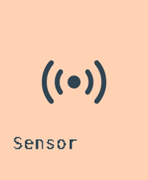
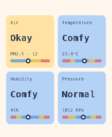
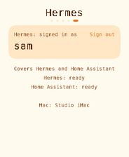

# Home Assistant plugin

Home Assistant adds the opt-in **Sensor** tile: air quality, temperature, humidity and pressure
from a fixed authenticated JSON endpoint. It is fully standalone; Hermes is not required.

| Sensor tile | Readings | Shared account |
|---|---|---|
|  |  |  |

These are firmware host renders with fictional readings/account state, not photos. The adapter
supports temperature, humidity, pressure, PM1, PM2.5 and PM10; unavailable values display `--`.

## Install

Requirements: Python 3.11+, a reachable RFC1918 host, Home Assistant, and an OIDC provider with
client credentials, RFC 8628 device authorization, explicit consent, userinfo names and groups.

Build and flash Home Assistant alone, or select both providers:

```sh
PROVIDERS=home_assistant NO_FLASH=1 ./dev.sh         # standalone Sensor
PROVIDERS=hermes,home_assistant NO_FLASH=1 ./dev.sh  # combined tiles
tools/flash.sh
```

Run the gateway-owned adapter with its private environment supplied by your service manager:

```dotenv
HOME_ASSISTANT_URL=https://home-assistant.example.com
HOME_ASSISTANT_TOKEN=REPLACE-IN-THE-PRIVATE-SERVICE-ENVIRONMENT
SENSOR_TEMPERATURE=sensor.room_temperature
SENSOR_HUMIDITY=sensor.room_humidity
SENSOR_PRESSURE=sensor.room_pressure
SENSOR_PM1=sensor.room_pm1
SENSOR_PM25=sensor.room_pm25
SENSOR_PM10=sensor.room_pm10
```

```sh
python3 bridge/examples/home-assistant-sensor-adapter.py
```

The adapter binds `127.0.0.1:8099`. Only the auth proxy reaches it, and only the adapter sends the
Home Assistant token to Home Assistant. The token never enters bridge configuration, firmware or
the board. Configure a confidential machine client accepted only for the fixed public sensor path,
with its provider-specific scope/audience and a bearer-only proxy rule before the deny rule. Register
a separate public phone client with `openid profile groups`. See [SETUP.md](SETUP.md#1-register-phone-approval-and-machine-access)
for the complete tested proxy and OIDC examples.

Install and initialize the standalone bridge:

```sh
python3 -m venv ~/.local/share/waveshare-bridge/venv
~/.local/share/waveshare-bridge/venv/bin/pip install -e ./bridge
export PATH="$HOME/.local/share/waveshare-bridge/venv/bin:$PATH"
waveshare-bridge init --provider home_assistant
waveshare-bridge run
```

The initializer asks for the machine token endpoint/client/scope/secret, resource URL/audience and
public phone client. It does not require a Hermes dashboard or create Hermes credentials. Keep the
machine secret in private `home-client.json` mode 0600; keep the Home Assistant token only in the
adapter's private service environment.

## Authorization and enrollment

Set `providers.home_assistant.sign_in.groups` to the groups allowed to read Sensor. The bridge checks
that phone/group approval before obtaining its short-lived machine token and calling the fixed sensor
resource. A Hermes authorization never grants Home Assistant access.

When both providers use the same issuer, public client id, device/token/userinfo paths and Host
header, they share one board QR/account and sign-out. Their group policies and machine clients remain
separate.

```sh
waveshare-bridge status
waveshare-bridge provider list
waveshare-bridge enroll
```

On the board open the **Home Assistant** account tab, select the bridge and approve only if the
six-digit codes match. Scan **Phone sign-in**, complete 2FA/consent and use an account in an allowed
Home Assistant group. `waveshare-bridge boards --remove ID` revokes a board;
`boards --revoke-phone ID` clears approval.

## Verify

- `status` and `provider list` show Home Assistant and Sensor (plus Hermes only if selected).
- Missing/wrong bearer, client, scope, audience, path or expired token is denied before the adapter.
- A signed-out/disallowed board receives the provider auth error; an allowed board receives a WHS1
  frame and plausible Sensor values.
- Neither the board nor bridge contains the Home Assistant API token. Group changes require a new
  phone approval.

For the full JSON contract, private-file schema, proxy order and troubleshooting, use the
self-contained [SETUP.md](SETUP.md) and [security model](../../docs/SECURITY.md).
